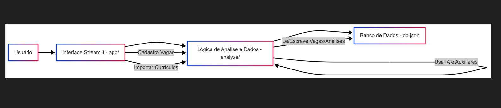
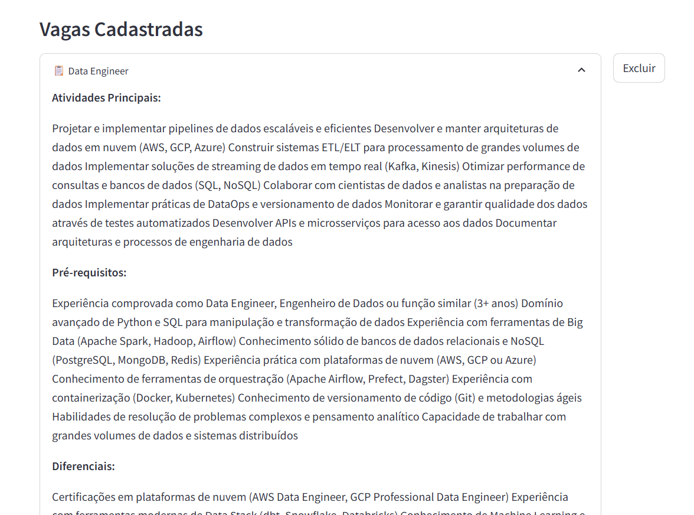
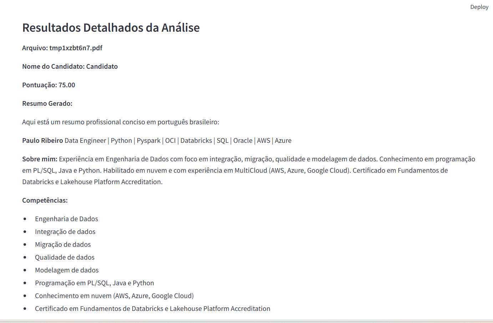
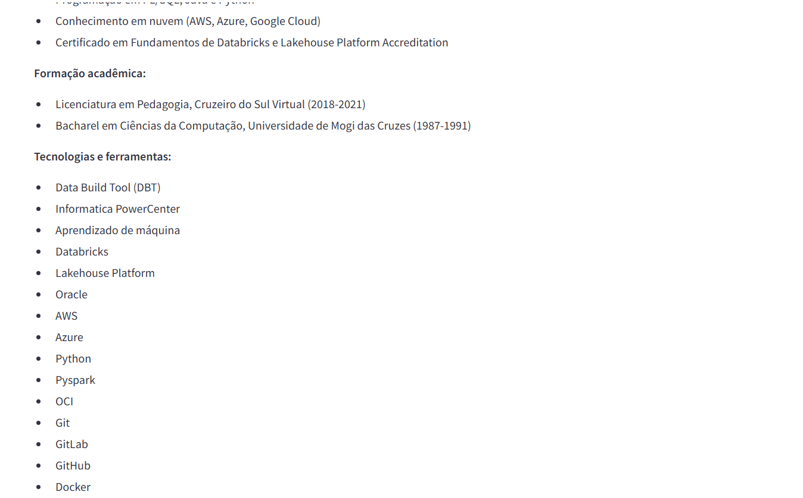
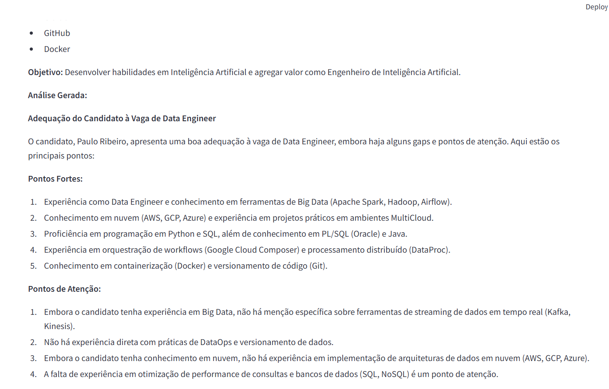
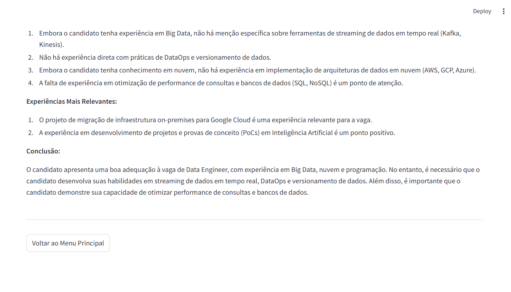

# Analisador de Currículos (CV Analyzer) - Versão 2.0

Este é um sistema inteligente de análise de currículos que utiliza IA para avaliar candidatos em relação a vagas específicas. O sistema foi desenvolvido para automatizar e otimizar o processo de triagem de currículos, agora com uma interface web moderna e intuitiva.




## Funcionalidades Principais

1. **Interface Web Moderna**
   - Menu principal intuitivo
   - Cadastro de vagas com formulário estruturado
   - Upload múltiplo de currículos
   - Visualização em tempo real do processamento

2. **Gerenciamento de Vagas**
   - Cadastro completo de vagas
   - Definição de atividades principais
   - Especificação de pré-requisitos
   - Listagem de diferenciais
   - Visualização de vagas cadastradas

3. **Processamento de Currículos**
   - Upload múltiplo de arquivos PDF
   - Seleção da vaga para análise
   - Barra de progresso em tempo real
   - Feedback visual do processamento
   - Tratamento de erros amigável

4. **Sistema de Pontuação**
   - Avaliação baseada em múltiplos critérios:
     - Experiência (30%)
     - Habilidades Técnicas (25%)
     - Educação (10%)
     - Idiomas (10%)
     - Pontos Fortes (15%)
     - Pontos Fracos (até -10%)

## Requisitos do Sistema

- Python 3.8+
- Streamlit 1.32.0+
- Chave de API do Groq (para o modelo de IA)

## Instalação

1. Clone o repositório:
```bash
git clone [URL_DO_REPOSITÓRIO]
cd cv-analyser
```

2. Instale as dependências:
```bash
pip install -r requirements.txt
```

3. Configure as variáveis de ambiente:
   - Crie um arquivo `.env` na raiz do projeto
   - Adicione sua chave de API do Groq:
   ```
   GROQ_API_KEY=sua_chave_aqui
   ```

## Como Usar

1. **Iniciando a Aplicação**
   ```bash
   streamlit run app/Home.py
   ```

2. **Cadastro de Vagas**
   - Acesse "Criar Nova Vaga" no menu principal
   - Preencha o formulário com os detalhes da vaga
   - Visualize as vagas cadastradas na lista abaixo

3. **Importação de Currículos**
   - Selecione "Importar Currículos" no menu principal
   - Escolha a vaga para análise
   - Faça upload de um ou mais currículos em PDF
   - Acompanhe o processamento em tempo real

## Estrutura do Projeto

```
cv-analyser/
├── analyze/
│   ├── models/
│   │   ├── ai.py            # Lógica de IA
│   │   ├── database.py      # Gerenciamento do banco de dados
│   │   ├── import_cv.py     # Importação de currículos
│   │   ├── create_job.py    # Criação de vagas
│   │   └── helper.py        # Funções auxiliares
│   └── app/
│       ├── pages/
│       │   ├── 1_📝_Cadastro_Vagas.py
│       │   └── 2_📄_Importar_Curriculos.py
│       └── Home.py          # Página principal
└── requirements.txt     # Dependências do projeto
```

## Tecnologias Utilizadas

- **Streamlit**: Interface web moderna e responsiva
- **LangChain**: Framework para processamento de linguagem natural
- **Groq**: Modelo de IA para análise de currículos
- **Pandas**: Manipulação de dados
- **SQLite**: Banco de dados local

## Novidades da Versão 2.0

1. **Interface Moderna**
   - Design limpo e intuitivo
   - Navegação simplificada
   - Feedback visual em tempo real

2. **Melhorias no Processamento**
   - Upload múltiplo de arquivos
   - Processamento em lote
   - Tratamento de erros aprimorado

3. **Gerenciamento de Vagas**
   - Interface dedicada para cadastro
   - Visualização organizada das vagas
   - Formulários estruturados

## Contribuição

Para contribuir com o projeto:

1. Faça um fork do repositório
2. Crie uma branch para sua feature (`git checkout -b feature/nova-feature`)
3. Commit suas mudanças (`git commit -am 'Adiciona nova feature'`)
4. Push para a branch (`git push origin feature/nova-feature`)
5. Crie um Pull Request

## Evidências :



 





